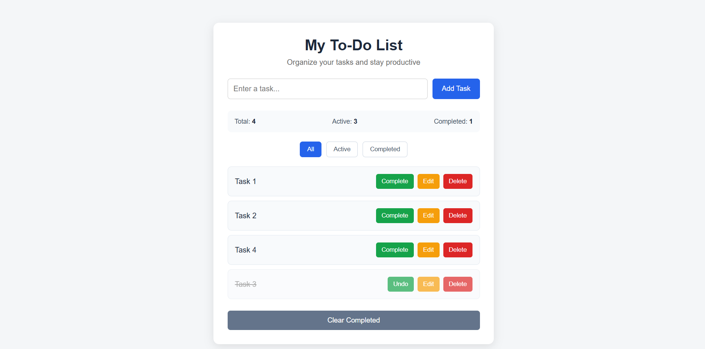

# 📝 To-Do List App

A simple and responsive **To-Do List web application** built using **HTML, CSS, and Vanilla JavaScript**. The application allows users to create, manage, edit, complete, filter, and delete tasks through an interactive and user-friendly interface.

This project was developed to practice and demonstrate core **frontend development and JavaScript concepts**.

---

## 🚀 Features

* ➕ Add new tasks
* ⌨️ Add tasks using the Enter key
* ✏️ Edit existing tasks
* ✅ Mark tasks as completed
* ↩️ Undo completed tasks
* 🗑️ Delete tasks
* 🔍 Filter tasks:

  * All
  * Active
  * Completed
* 📊 Display task statistics:

  * Total Tasks
  * Active Tasks
  * Completed Tasks
* 🧹 Clear all completed tasks
* 📱 Responsive design for desktop, tablet, and mobile
* 💬 Empty-state messages when no tasks are available

---

## 🛠️ Technologies Used

* **HTML5** – Structure of the application
* **CSS3** – Styling and responsive design
* **JavaScript (ES6)** – Application logic and DOM manipulation

---

## 📂 Project Structure

```text
todo-list/
│
├── index.html      # Application structure
├── style.css       # Styling and responsive design
├── script.js       # Application logic
└── README.md       # Project documentation
```

---

## 🧠 JavaScript Concepts Used

This project demonstrates several important JavaScript concepts:

* Variables
* Arrays
* Objects
* Functions
* DOM Manipulation
* Event Listeners
* Conditional Statements
* Array Methods

  * `forEach()`
  * `filter()`
  * `map()`
  * `find()`
* Template/Dynamic UI creation
* Event handling
* Application state management
* Keyboard events
* Dynamic statistics calculation

---

## ⚙️ How It Works

### 1. Add Task

Enter a task in the input field and click **Add Task** or press **Enter**.

The task is stored as a JavaScript object inside the tasks array.

```javascript
{
    id: 1,
    title: "Learn JavaScript",
    completed: false
}
```

### 2. Complete Task

Click the **Complete** button to mark a task as completed.

The completed task receives a different visual style and a strikethrough effect.

### 3. Edit Task

Click the **Edit** button to modify an existing task.

### 4. Delete Task

Click the **Delete** button to remove a task from the list.

### 5. Filter Tasks

Use the filter buttons to display:

* All tasks
* Active tasks
* Completed tasks

### 6. Task Statistics

The application automatically calculates and displays:

```text
Total Tasks
Active Tasks
Completed Tasks
```

### 7. Clear Completed

The **Clear Completed** button removes all completed tasks from the application.

---

## 💻 How to Run

No installation or additional software is required.

### Method 1 – Open Directly

1. Download or clone the repository.
2. Open the project folder.
3. Double-click `index.html`.
4. The application will open in your browser.

### Method 2 – Using VS Code

1. Open the project folder in VS Code.
2. Open `index.html`.
3. Run it using a browser or the Live Server extension.

---

## 📸 Application Preview

Add screenshots of your project here after uploading them to the repository.

```text
screenshots/
├── desktop.png
└── mobile.png
```

Example:



---

## 🎯 Project Purpose

The main purpose of this project is to strengthen practical knowledge of **HTML, CSS, and JavaScript** by building an interactive frontend application from scratch.

It demonstrates how JavaScript can be used to manage application data, manipulate the DOM, respond to user actions, and dynamically update the user interface.

---

## 🔮 Future Improvements

Possible future improvements include:

* 💾 LocalStorage for persistent tasks
* 🌙 Dark/Light mode
* 📅 Task due dates
* ⭐ Task priority
* 🔎 Search functionality
* 🏷️ Task categories
* 🔔 Notifications/reminders
* 📊 Task completion analytics
* Drag-and-drop task ordering

---

## 📚 What I Learned

Through this project, I practiced:

* Building a responsive frontend using HTML and CSS
* Manipulating HTML elements using JavaScript
* Managing application state using arrays and objects
* Handling user interactions with event listeners
* Using JavaScript array methods
* Dynamically generating UI elements
* Creating responsive layouts using CSS media queries

---

## 👨‍💻 Author

**Vighnesh**

Computer Engineering Student
Frontend Development Enthusiast

---

## 📄 License

This project is created for **learning and portfolio purposes**.
